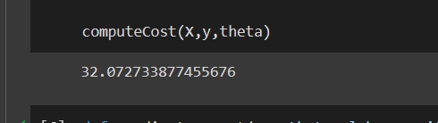

# Implementation-of-Linear-Regression-Using-Gradient-Descent

## AIM:
To write a program to predict the profit of a city using the linear regression model with gradient descent.

## Equipments Required:
1. Hardware – PCs
2. Anaconda – Python 3.7 Installation / Jupyter notebook

## Algorithm
  1.Import the required library and read the dataframe.
  2.Write a function computeCost to generate the cost function.
  3.Perform iterations og gradient steps with learning rate.
  4.Plot the Cost function using Gradient Descent and generate the required graph.
## Program:

/*
Program to implement the linear regression using gradient descent.
Developed by: praveen s
RegisterNumber:  212222240077
*/
```
import numpy as np
import matplotlib.pyplot as plt
import pandas as pd
data=pd.read_csv("ex1.txt",header =None)
plt.scatter(data[0],data[1])
plt.xticks(np.arange(5,30,step=5))
plt.yticks(np.arange(-5,30,step=5))
plt.xlabel("Population of City (10,000s)")
plt.ylabel("Profit ($10,000)")
plt.title("Profit Prediction")
def computeCost(X,y,theta):

  m=len(y)
  h=X.dot(theta)
  square_err=(h-y)**2
  j=1/(2*m)* np.sum(square_err)
  return j
  
data_n=data.values
m=data_n[:,0].size
X=np.append(np.ones((m,1)),data_n[:,0].reshape(m,1),axis=1)
y=data_n[:,1].reshape(m,1)
theta=np.zeros((2,1))

computeCost(X,y,theta)
def gradientDescent(X,y,theta,alpha,num_iters):
  m=len(y)
  J_history=[]

  for i in range (num_iters):
    predictions=X.dot(theta)
    error = np.dot(X.transpose(),(predictions-y))
    descent=alpha*1/m * error
    theta-=descent
    J_history.append(computeCost(X,y,theta))  
  return theta,J_history  
  
 theta,J_history = gradientDescent(X,y,theta,0.01,1500)
print("h(x) ="+str(round(theta[0,0],2))+" + "+str(round(theta[1,0],2))+"x1" )


plt.plot(J_history)
plt.xlabel("Iteration")
plt.ylabel("$J(\Theta)$")
plt.title("Cost function using Grading Descent")

```
## Output:




## Result:
Thus the program to implement the linear regression using gradient descent is written and verified using python programming.
